# What is #30DayChartChallenge

Over the last three years (2023-2025) I've been participating in the [#30DayChartChallenge](https://bsky.app/hashtag/30DayChartChallenge), which is an event in the data visualization community in which participants are challenged to create 30 charts in 30 days of the month of April based on the prompts provided by the orgss.

Here's the example of prompts for 2024.

[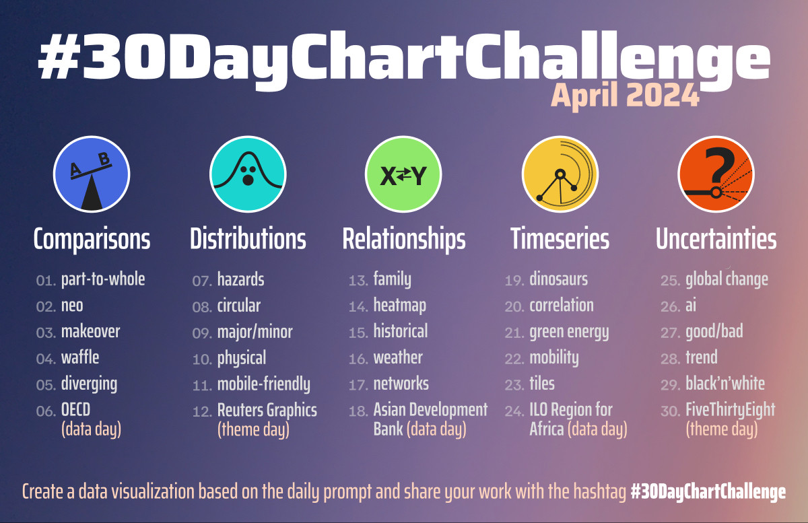](https://bsky.app/profile/30daychartchall.bsky.social/post/3ko5ppgz5l22r)

I found it a useful tool to explore my interest in the data visualization as well as a great way to keep a structured approach to learning and doing and holding myself accountable.

With three years, four books and 90+ visualizations behind my belt, this is a collection of practical advice for people wanting to participate in the challenge interleaved with my observations about visualizing data in general.

# General thoughts

## Know what you want to get out of it

It's difficult to make something great every day in the few hours in the evening after your day job while learning new tools. IMO There are two way to approach the challenge.

-   "I will make something great using tools I already know"
-   "I will make *something* and acquire new skill along the way"

The latter is my preferred approach, and I've been happy using the skills acquired during this challenge in my day job.

## Interpret prompts losely

Treat the prompt as a vague suggestion, not a mandate.

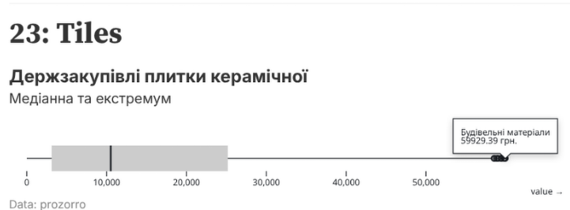

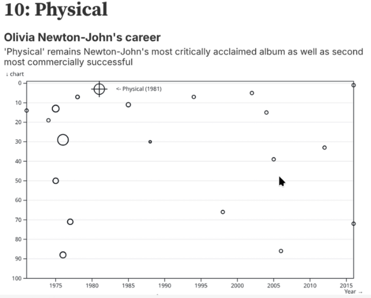

# Get the data

## Reusing datasets

Searching for the right data set to make the graph look just right can be a huge time sink. I recommend finding a couple of data sets that are interesting to you in advance and using them throughout the month.

Examples of using the same data for different prompts

|  |  |
|-----------------------------|-------------------------------------------|
| [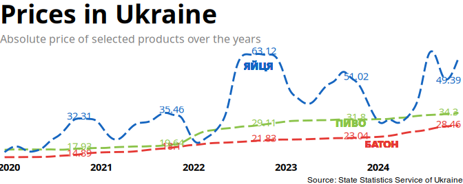](/charts/18elpais/18elpais.qmd) | [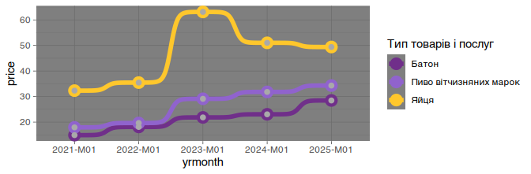](/charts/19smooth/19smooth.qmd) |
| [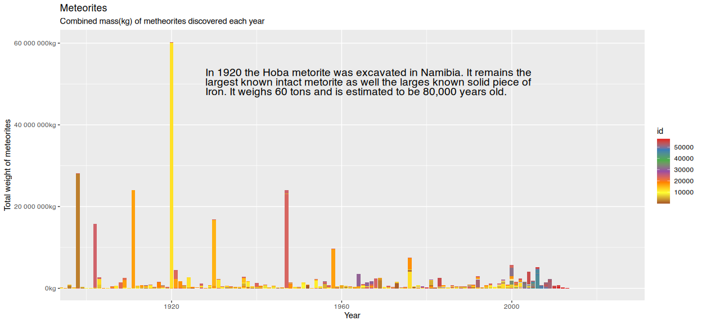](/charts/22stars/22stars.qmd) | [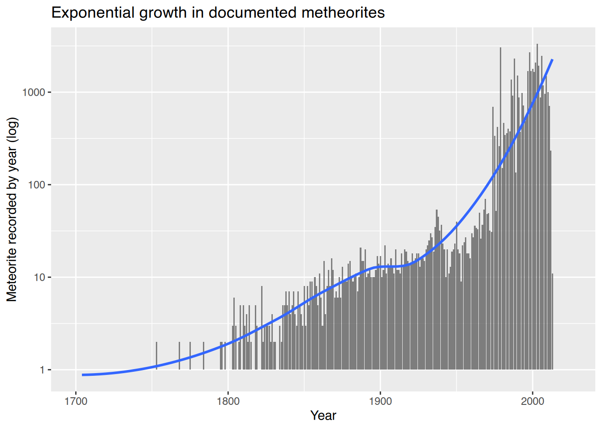](/charts/23logscale/23logscale.qmd) |

## Using personal datasets

Plotting the data that you source yourself or is about yourself is fun and has an added benefit in that you already have an intuitive feel for the dataset, so it's easier to plan out your visualizations.

|                         |                         |
|-------------------------|-------------------------|
| 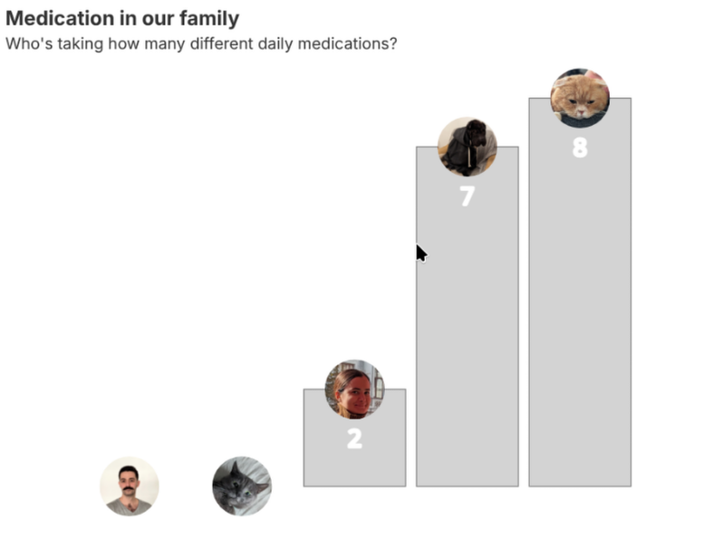 | 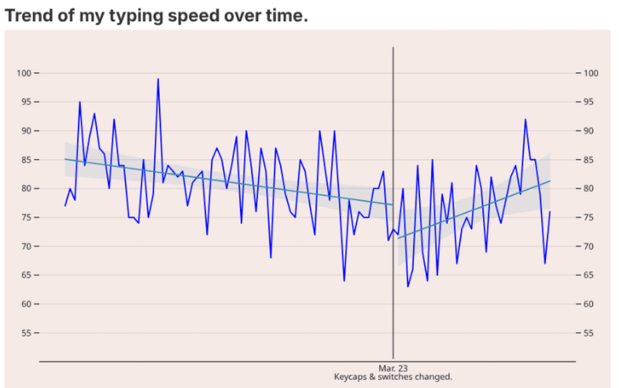 |

## Data sources

data.gov.ua and the new [stat.gov.ua](https://stat.gov.ua/) are great, but have a varying quality of data. Many datasets are in xls or in csv with archaic encodings (CP-1252 anyone?). Some good sources for clean and tidy data sets. - [OWID](https://ourworldindata.org/) - [TidyTuesday](https://tidytues.day/) - [Kaggle](https://www.kaggle.com/) - [eurostat](https://ec.europa.eu/eurostat) - [NYC OpenData](https://opendata.cityofnewyork.us/)

# Visualisations

## Verbosity
In the moment while dealing with data it might seem redundant or overly verbose to add labels, subtitles, tags, etc. But they contribute to overall quality of your graph and make it easier to understand.

|                         |                         |
|-------------------------|-------------------------|
|  | 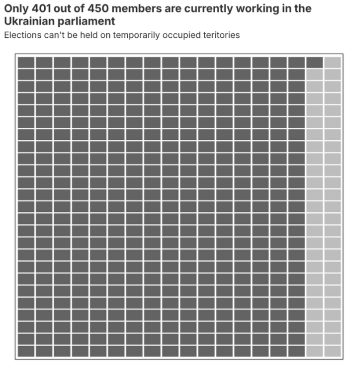 |

More examples of annotations helping to tell a story

|                         |                         |
|-------------------------|-------------------------|
| [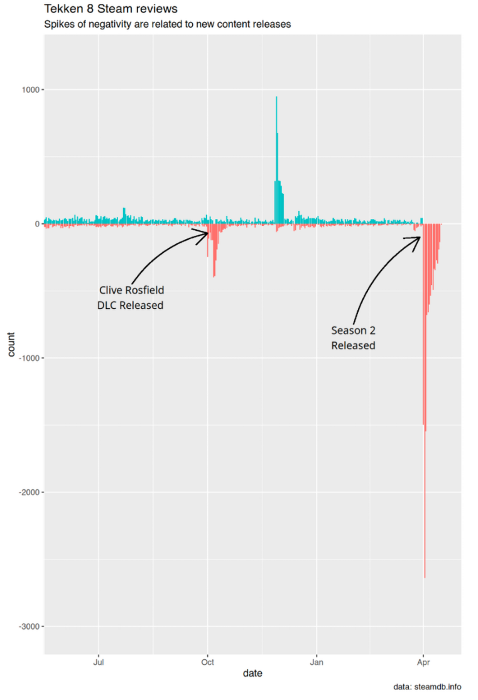](/charts/16negative/16negative.qmd) | [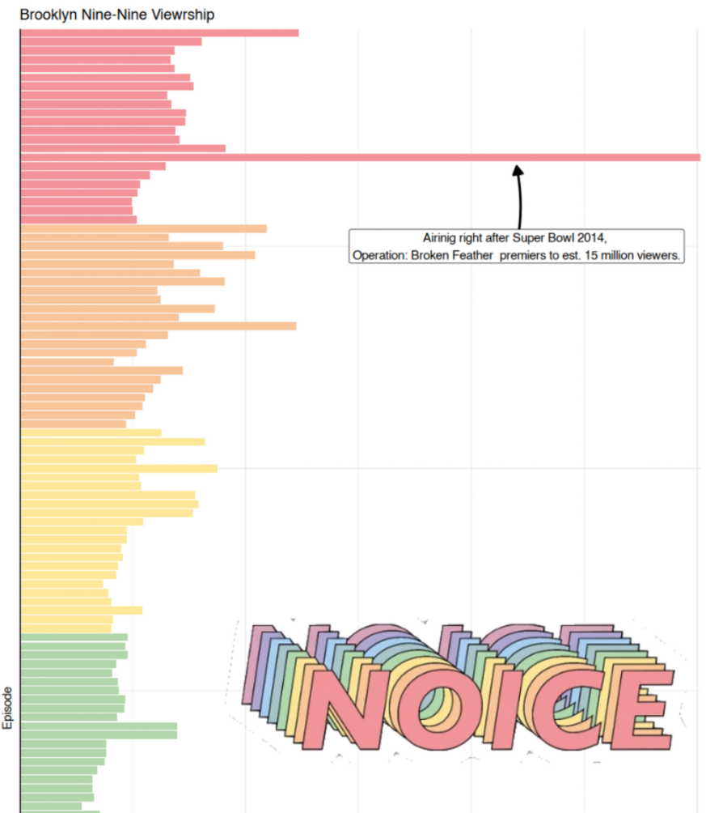](/charts/27noise/27noise.qmd) |

## Interactivity

Interactivity via web-widgets is cool, but doesn't land itself well to print or easy sharing.  Don't use it at all; or go all-in and create interactive publications. It's usually better to just label the data. [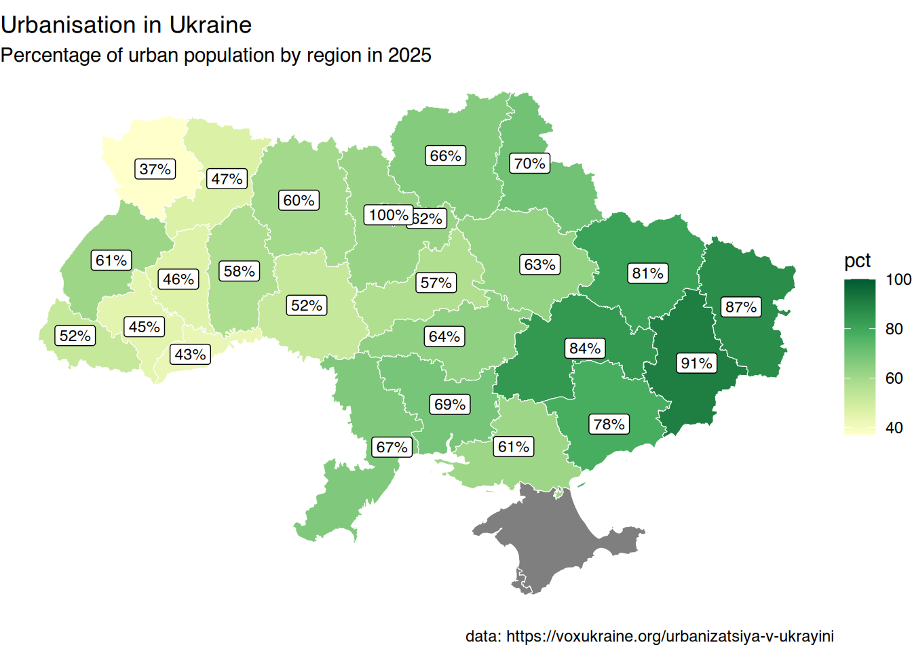](/charts/20urbanisation/20urbanisation.qmd)

## Colors and pallets

Picking the right color pallet, creating appropriate contrast, choosing fonts, making the graph visually appealing. is difficult Study and use ready made color pallets. Find out about [ColorBrewer](https://colorbrewer2.org/#type=sequential&scheme=BuGn&n=3), [paletteer](https://r-graph-gallery.com/package/paletteer.html), [color finder](https://r-graph-gallery.com/color-palette-finder)

This will help you avoid things like this

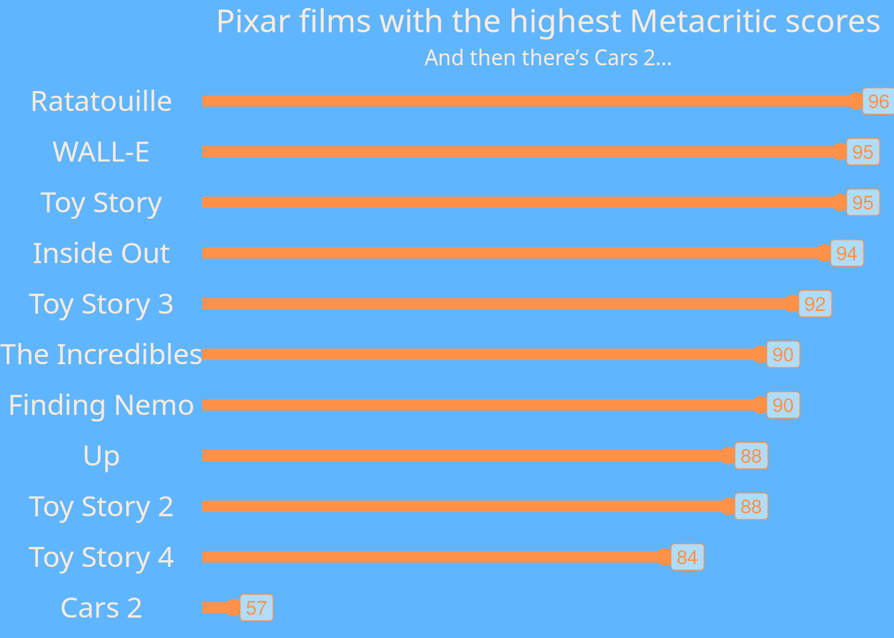

## Maps are hard
Visualizing data on a map, dealing with shape files, boundaries, etc is difficult. 
Check out [https://30daymapchallenge.com/](https://30daymapchallenge.com/) if you're interested in that.

## Pie charts are terrible

Humans aren't good at interpreting angles. A stacked bar chart or a table is almost always better than a pie chart. To my surprise most dataviz tools don't have a proper built-in way of doing pie charts. I reckon it's because people developing know what's up.

The following chart illustrates almost all pitfalls mentioned above...

## Oh, and don't do this, I guess...

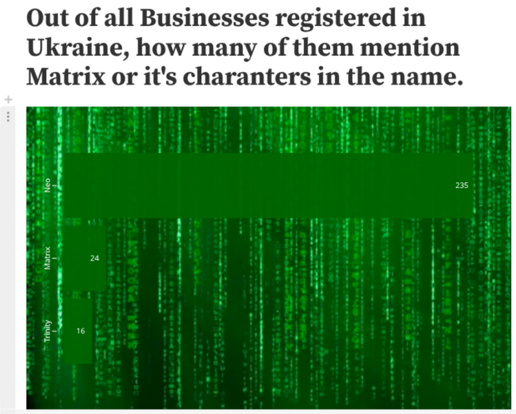

# Steal

Get inspiration (and source code) from talented people on social media by following [#30DayChartChallenge](https://bsky.app/hashtag/30DayChartChallenge), [#TidyTuesday](https://bsky.app/hashtag/TidyTuesday), [Nicola Rennie](https://bsky.app/profile/nrennie.bsky.social) and more.

# Cheat

Sometimes tools like Google Analytics are able to produce great visualizations, repeating which would be a redundant exercise. Use them. [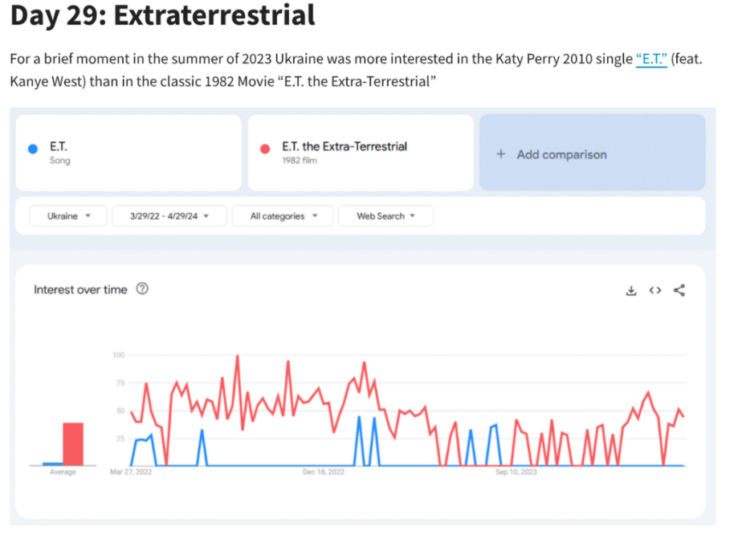](/charts/29exraterrestrial/29exraterrestrial.qmd)

# Repeat
Doing the challenge many years in a row allows to revisit and redo some of the plots from previous year.

This is how

Turned into 

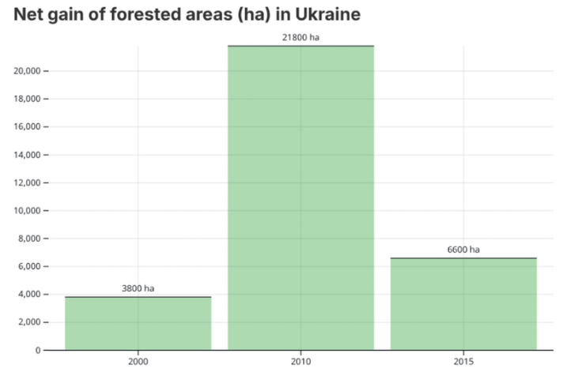

# Conclusion

